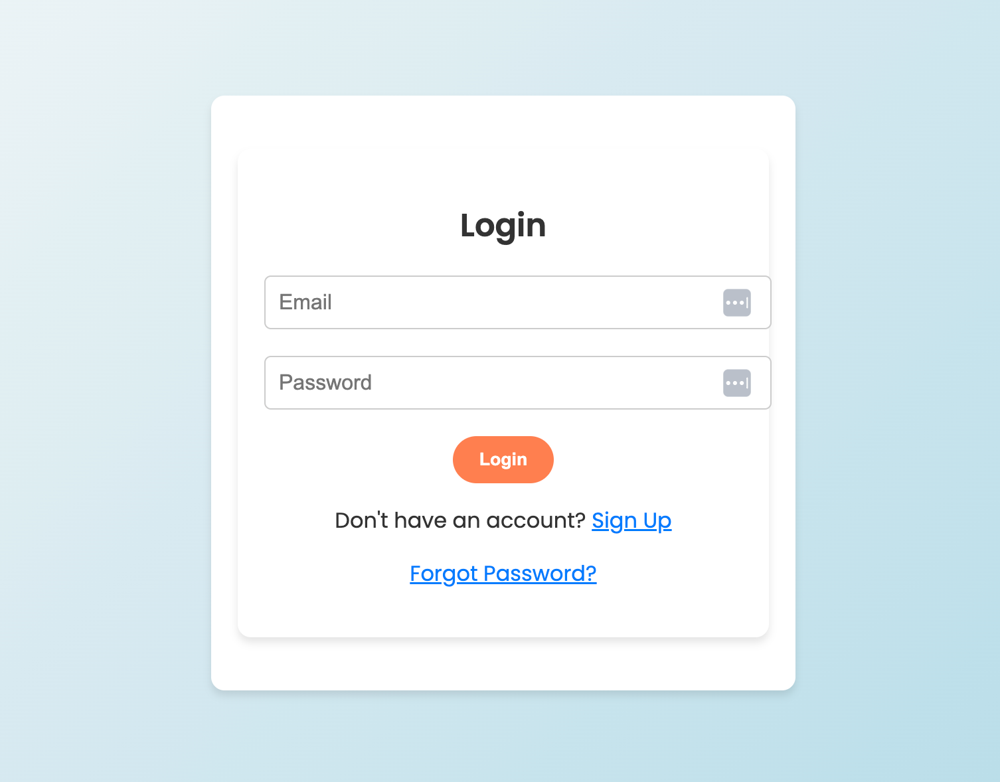
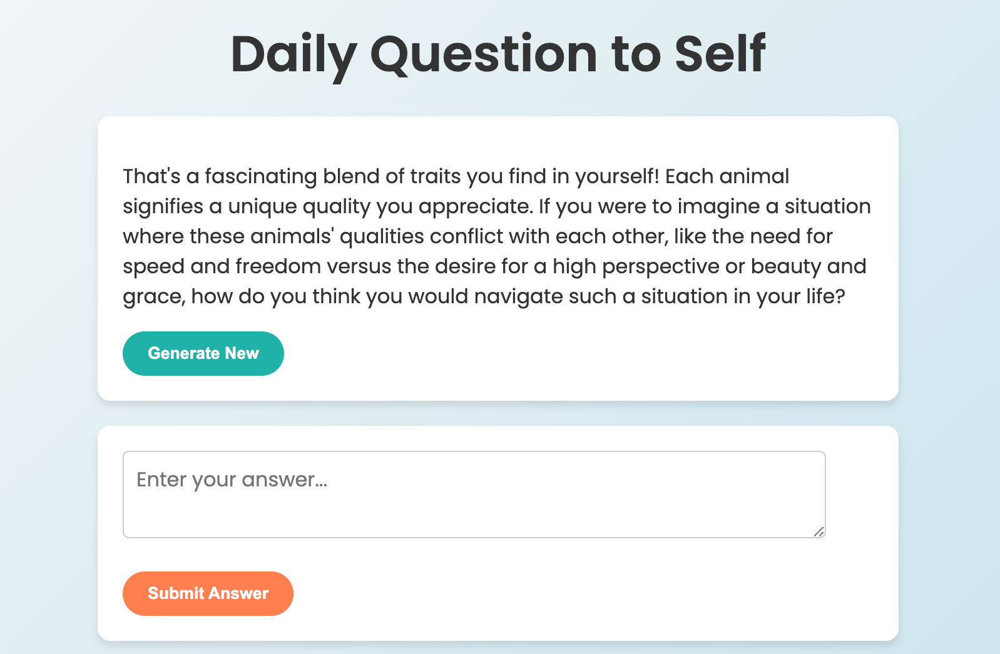
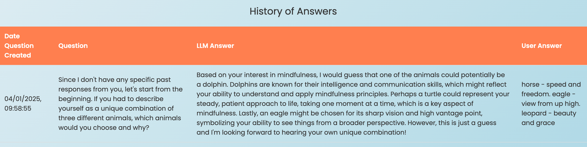

# DailyQ // Mindful Reflection App

A mindfulness and self-reflection web application that generates thoughtful questions and stores user responses.

## Features

- User authentication (Firebase)
- AI-powered question generation (OpenAI API)
- Responsive design
- History of user reflections

## Installation

1. Clone the repository:
```
git clone https://github.com/YourUsername/dailyq.git
cd dailyq
```

2. Set up a virtual environment:
```
python -m venv venv
source venv/bin/activate  # On Windows: venv\Scripts\activate
```

3. Install dependencies:
```
pip install -r requirements.txt
```

4. Set up environment variables:
Create a .env file:
```
OPENAI_API_KEY=your-openai-api-key
FIREBASE_CONFIG=your-firebase-config
```
Ensure python-dotenv is installed.

5. Run the app:
```
python app.py
```

6. Access the app at http://localhost:8000.

## Deployment
Frontend: Firebase   
Backend: Heroku

## Technologies Used
Backend: Python, SQLite  
Frontend: HTML, CSS, JavaScript  
Authentication: Firebase  
AI Integration: OpenAI API  

## Screenshots





## License
No license